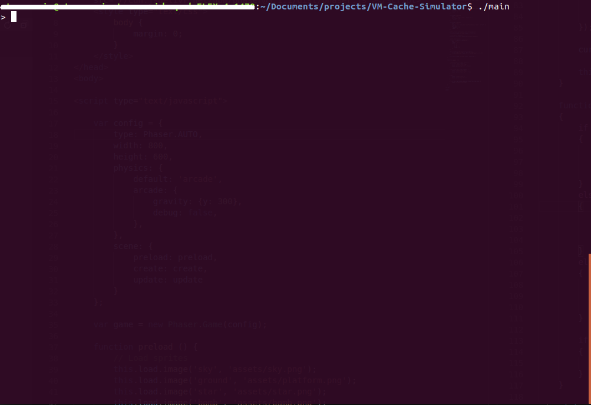
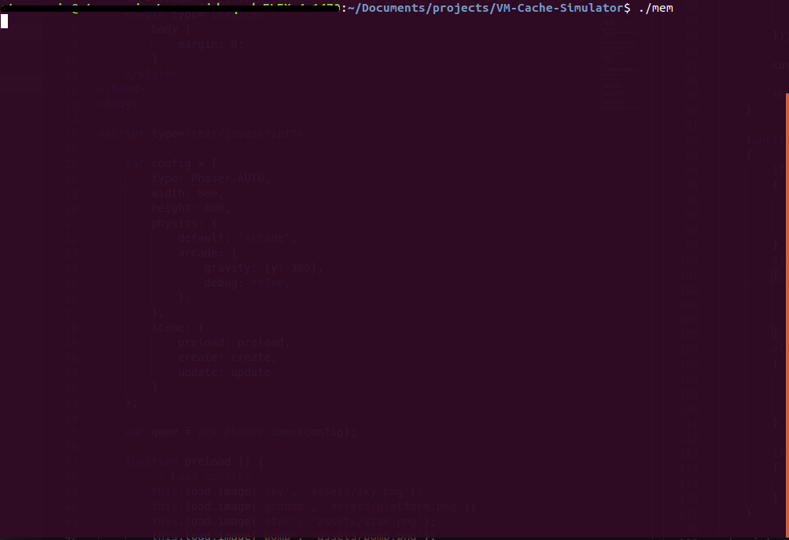
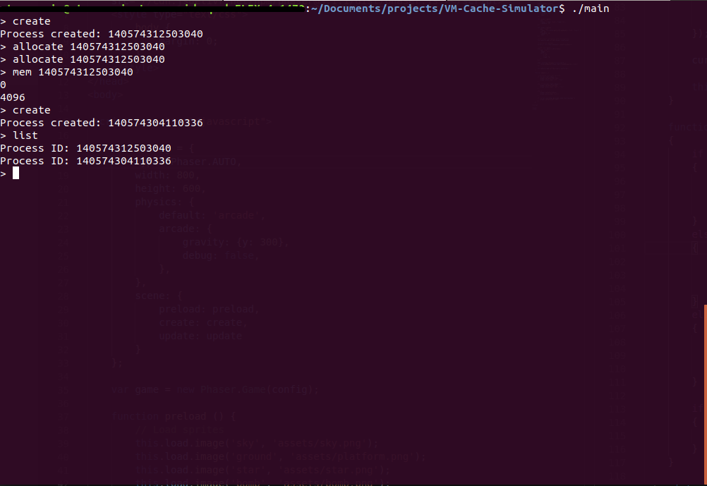
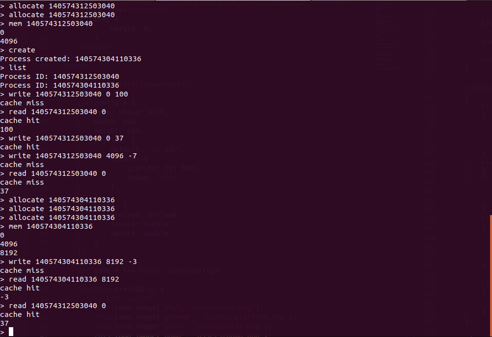

# Virtual Memory and Cache Simulator

The purpose of this program is simulate a virtual memory system as well as a
simple direct mapped cache.

On startup the program will wait briefly for 5 seconds. In order the simulate
realtime latency, whenver a user attempts to read or write from 'main memory',
the program will wait a brief amount of time.

When a user attempts to access a 'physical' address that is stored
in the cache, the program will print `cache hit` and will immediately proceed
with the rest of the command. If the 'physical' address is not stored in the
cache, then the program will print `cache miss` and react accordingly depending
on the command.

On read, if the address is cached then the program will print the value stored
at the particular address. If the address is not cached, then the program will
retrieve it from 'main memory', then cache the address, and then finally print
the value stored at the address.

On the write command, the cache will evict whatever is stored inside the set 
that the address will be cached in. To avoid accessing memory every time the
write command is used, we simply leave the updated value inside the cache 
until we are forced to evict the particular line. Thus, we delay writing back
to 'main memory' as much as possible.

### To Run this Program
To compile the program, type `make` into the shell. Afterwards, make sure
that both `main` and `mem` are running.

### Using this Program
This program comes with a few simple commands.

1. `create` -- Creates a new 'process'. Each process will have an associted 
and unique thread id (`tid`), and its own page table allocated

2. `list` -- Lists all of the processes that have been created by their value
of `tid`.

3. `allocate X` -- Allocates a 'physical' address and create a corresponding 
virtual memory address for the process with `tid` equal to `X`.

4. `mem X` -- Lists all of the virtual memory addresses currently in use by 
the process with `tid` equal to `X`.

5. `kill X` -- Ends a process with `tid` equal to `X`. Afterwards, the 
'physical' memory addresses associated with the process will be deallocated.

6. `read X Y` -- Retrieves the value at virtual address `Y` of process `X`.

7. `write X Y Z` -- Writes the value `Z` into the virtuall address `Y` of 
process `X`.

8. `exit` -- Exits the program and frees all allocated memory.

## Pictures
__Main Application__

__Mem Application__

__Screenshot__

__Another Screenshot__

